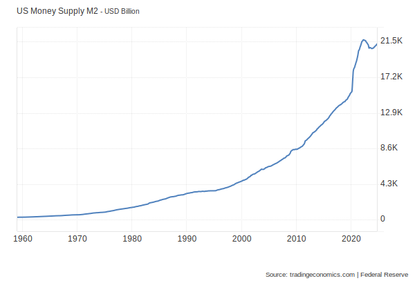
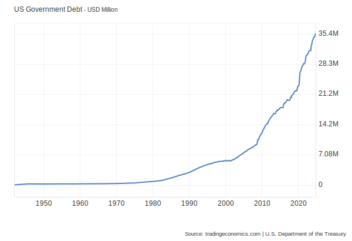
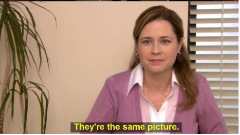

# Breaking point

You and I could easily go through life without giving much thought to government or politics. Honestly, I understand the argument that it’s a complete waste of time (and I agree). That’s why I stopped paying attention to politicians in my country years ago. But we've reached a point where everyone can feel the is not economy getting. It affects both you and me, whether we care about it or not.

### Something has changed

A few years ago, hardly anyone talked about “inflation”, now it is everyday reality.

Why is everything getting more expensive ? We have experienced:

- global pandemic
- supply chain issues
- wars and conflicts (still ongoing)

All of the above certainly contributed to inflation. But it’s nearly 2025 now.

The pandemic is over, supply chain issues have been resolved. After all, economies have always had ups and downs. Things should be getting better right?

### Systematic problem

I’m going to argue that the outlook and may not improve anytime soon, and here’s why. Let’s look at the [US money supply](https://tradingeconomics.com/united-states/money-supply-m2) (situation is similar in almosy all western [countries](https://tradingeconomics.com/euro-area/money-supply-m2)).

You can see that inflation started its exponential trajectory **decades ago**.

### Rate of change

I often find myself wondering how quickly prices have changed. When we go for lunch, 10 euros has become the new standard. It was just few years back that 4-6 euros was the norm. How insane is that.

### Inflation

Lets be clear about what inflation really is and what causes is. There are two types of inflation:

- **Temporary inflation,** caused by:
    - supply chain issues (logistics and transportation problems)
    - unexpected climate and weather events
    - [energy prices](https://www.statista.com/statistics/1267500/eu-monthly-wholesale-electricity-price-country/), …

All of these events can cause price to increase for certain products or domains. But prices should come down eventually when the underlying effect that caused it is resolved.

- **Systematic inflation,** caused by:
    - central banks printing new money, diluting value of current holders of currency. This inflation is however permanent and prices will never come down once newly printed money are out in the economy.

You should really care about only for the later. You can not control whether events, or supply chain issues after all.

### “Greedy corporations”

Media and politicians will try to sell you the idea that “greedy corporations” are hijacking prices and they will make sure that they will not let that happen. But food supermarket industry is highly competing market, they margins are 1-3% on average. Stop lying to people.

Or they try to focus on [temporary inflation pressures](https://x.com/BloombergTV/status/1672159431705128961). Ignore that noise. Why are prices of houses, rents and **everything else** keeps going up forever? Due to increasing money supply. 

Sometimes they are [confronted](https://x.com/LynAldenContact/status/1529576495638773762)  and you can see they know they fucked up.

Bu central bankers are not a solely responsible for inflation. In reality, politicians and incompetent governments are. Lets compare two graphs above.

> Corporate needs you to find out differences between these two pictures.
> 

Well but how ? Put it simply

1. You as a citizen pays taxes
2. Government uses those taxes to run the the state
3. But what if government spends more than they receive from taxes ?
4. They will borrow money of course ! By [issuing bonds](https://www.statista.com/statistics/201881/holders-of-the-us-public-debt/).
5. But government always increases its debt + needs to pay back interest.
6. Central bank will come and “helps” those countries that needs more money by buying their bonds. Wait, but where central bank finds money for that ? They have money printer, so do not worry [there is infinity amount of cash at he federal reserve](https://x.com/patrickbetdavid/status/1635616070286573569).

What just happened ? Well you just used/injected money that you **never had** into the economy and use them to fund whatever government program.

## Now what ?

As you could see government loves to spend more money than they have. But is there a really such a big problem ? **Well yes !** Do you remember the ever expanding government debt chart ? With increasing number of debt there is interest rate that needs to be paid on top of it**.**

First time in history, interest rate on borrowed money is now [so big](https://www.crfb.org/blogs/interest-costs-just-surpassed-defense-and-medicare) ****that exceeds expenditure of whole Military budget.

## Are governments broke ?

When your second biggest expenditure is interest rate alone and it is projected to increase even more, technically “yes they are”. That debt + interest needs to be payed.  But how can you pay for it when your country is still in deficit needs to borrow even more ? Well central bank can always print money from thin air ! But that leads to even **more inflation!** If this cycle does not break very soon than we are on path to “**hyper inflation**”. We are very close to debt spiral

 Look at Turkey and their exploding [government debt](https://tradingeconomics.com/turkey/government-debt) and [hyper inflation](https://tradingeconomics.com/turkey/inflation-cpi).

It may not be as bad as in turkey but you can certainly expect next inflationary wave/s due to money printing that they can not avoid.

## The only way out

The only way out of this debt spiral is for governments to **curb excessive spending**. We should not accept higher taxes if there is no commitment to reducing government expenditure. What we need is a leaner, more efficient government not a larger one (addicted on never ending borrowing and bailouts of central banks).

## Wind of change

To this day, I have been very sceptical about the future. Shrinking the government has always been politically unpopular move. But with the Republicans winning the 2024 U.S. elections and Elon Musk’s direct involvement in politics, I believe he will deliver on what he [says](https://www.youtube.com/shorts/z5MonxlgqO0).

If not him and not now, then all western governments will follow similar path to Turkey or other countries that lost control of their exploding government debt.